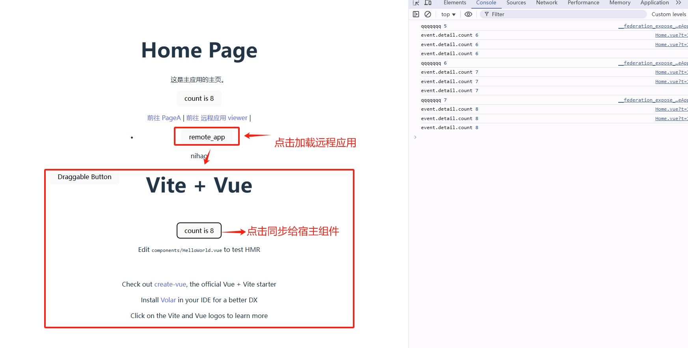

# 模块联邦使用实例 vue 
> 主要包含的功能点。
1. 远程应用暴露模块
2. 宿主应用编译时加载远程应用模块
3. 宿主应用运行时加载远程应用

* 依赖 
1. nodejs 18


## 主要实现步骤 

1. remote 需要配置好 `vite.config.ts` 文件，暴露 federation 模块 见 my-vue-app/vite.config.ts
2. 宿主应用里面，需要实现运行时加载 remote 的功能，需要配置 `vite.config.ts` 文件，引入 federation 模块，详见 host-app/src/pages/Home.vue
3. 配置 host-app/public/remoteApp.js 文件，用于加载远程应用，这个后期可以通过服务端的接口来提供这些数据。
4. 示例  

### 启动

```bash

# 打包 my-vue-app 
cd my-vue-app
pnpm build 

# 根目录启动静态服务器，用来提供远程应用静态服务，可以使用任意静态服务器
npx serve -l 3001 -C

# 启动宿主应用
cd host-app
pnpm dev

```

## Host app vite.config.ts 配置 federation 引入远程应用

```ts vite.config.ts
import { defineConfig } from 'vite'
import vue from '@vitejs/plugin-vue'
import federation from '@originjs/vite-plugin-federation'

// https://vite.dev/config/
export default defineConfig({
  plugins: [
    vue(),
    federation({
      name: 'host_app',
      remotes: {
        // 如果路径不同，按实际情况改
        remote_app: 'http://localhost:3001/remoteEntry.js'
      },
      shared: ['vue']
    })
  ],
  build: {
    target: 'esnext',
    minify: false,
    cssCodeSplit: false
  },
})

```

## Remote app 1 vite.config.ts 配置 federation 暴露模块 

```ts vite.config.ts
import { defineConfig } from 'vite'
import vue from '@vitejs/plugin-vue'
import federation from '@originjs/vite-plugin-federation'

// https://vitejs.dev/config/
export default defineConfig({
  base: './', // 相对路径模式
  plugins: [
    vue(),
     federation({
      name: 'remote_app', // 远程应用名
      filename: 'remoteEntry.js', // 暴露出来的入口文件
      exposes: {
        // 想要暴露给外部使用的模块
        './RemoteApp': './src/App.vue',
      },
      shared: ['vue'], // 共享依赖
      /**
       * 关键：让它自动推断资源路径，不再额外拼接 assets
       */
      // publicPath: 'auto'
    })
  ],
  build: {
    assetsDir: '',
    target: 'esnext',
    minify: false,
    cssCodeSplit: false
  },
})
```

## 关于部署

- 远程应用部署到 CDN 或者可访问的静态资源服务器，或者直接交给 host-app 去部署。
- host-app 部署到任意静态资源服务器即可。